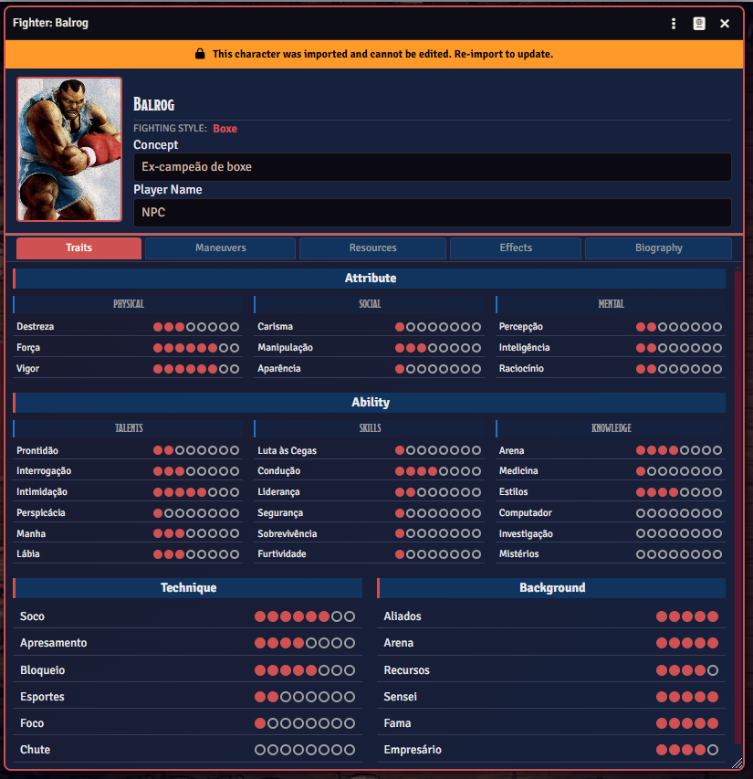
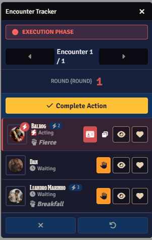
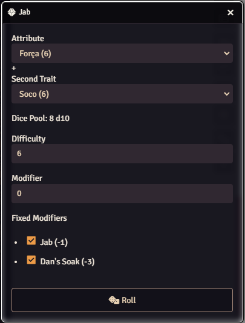
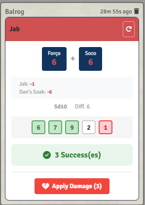

# Street Fighter RPG System

> 🌐 *This README is in Portuguese. The system is also available in English.*

Sistema não-oficial de RPG baseado no universo Street Fighter para **Foundry VTT v13+**.

## Sobre

Este sistema implementa as regras do **Street Fighter: The Storytelling Game** (White Wolf, 1994) para o Foundry VTT, permitindo jogar campanhas de RPG com lutadores de artes marciais, golpes especiais e combates táticos por turnos.

## 📱 Integração com Fighter Sheet App

Este sistema foi projetado para funcionar em conjunto com o aplicativo **Fighter Sheet**, também desenvolvido por Kirlian Silvestre.

### O que é o Fighter Sheet?

O **Fighter Sheet** é um aplicativo companion para criação e gerenciamento de personagens do Street Fighter RPG. Ele oferece:

- Criação guiada de personagens seguindo as regras oficiais
- Validação automática de pontos de experiência
- Biblioteca completa de atributos, habilidades, técnicas e manobras
- Estilos de luta com suas manobras especiais
- Exportação de personagens para uso no Foundry VTT

🔗 **Download**: [https://3darkman.itch.io/fighter-sheet](https://3darkman.itch.io/fighter-sheet)

### Importando Personagens

Para importar um personagem do Fighter Sheet:

1. No aplicativo Fighter Sheet, exporte seus personagens (formato `.fscharacter`)
2. No Foundry VTT, abra a aba de actors e clique em importar personagens
3. Use a opção de importação para carregar o arquivo
4. É importante que todos o conteúdo que o personagem use, já esteja cadastrado no mundo do foundry, assim o personagem já terá tudo corretamente.

### Personagem Importado vs. Criado no Foundry

| Aspecto | Importado do Fighter Sheet | Criado no Foundry |
|---------|---------------------------|-------------------|
| **Validação de Regras** | ✅ Validado durante a criação | ❌ Sem validação |
| **Pontos de XP** | ✅ Calculados corretamente | ⚠️ Manual |
| **Itens Incluídos** | ✅ Atributos, habilidades, técnicas e manobras | ⚠️ Requer criação manual |
| **Flexibilidade** | ✅ Suporta homebrew do app | ✅ Total liberdade |
| **Recomendado para** | Jogadores e GMs | Ajustes rápidos e testes |

> **💡 Importante**: O sistema é distribuído **sem conteúdo pré-cadastrado**. Você deve importar personagens e bibliotecas do Fighter Sheet ou criar manualmente os itens no Foundry. O Fighter Sheet também suporta conteúdo homebrew, permitindo que você crie suas próprias bibliotecas de atributos, habilidades, técnicas, antecedentes, armas e manobras.

## Características Principais

### 🥋 Ficha de Lutador Completa

- **Atributos** organizados em categorias (Físicos, Sociais, Mentais)
- **Técnicas de Combate** para cálculo de manobras
- **Habilidades** divididas em Talentos, Perícias e Conhecimentos
- **Antecedentes** para história e recursos do personagem
- **Recursos**: Saúde, Chi e Força de Vontade com barras visuais
- **Estilos de Luta** com manobras especiais

### ⚔️ Sistema de Combate por Fases

O combate segue o sistema clássico de Street Fighter com três fases distintas:

1. **Fase de Seleção**: Todos os combatentes escolhem suas manobras secretamente
2. **Fase de Execução**: Manobras são reveladas e resolvidas por ordem de velocidade
3. **Resolução**: Dano é aplicado e efeitos são processados

### 🎯 Manobras de Combate

- **Cálculo Automático**: Velocidade, Dano e Movimento calculados com base nos atributos e técnicas
- **Modificadores de Armas**: Armas equipadas modificam automaticamente as manobras
- **Efeitos Ativos**: Modificadores temporários aplicados às manobras

### ✨ Sistema de Efeitos Ativos

Sistema robusto de Active Effects que permite modificar:

| Tipo de Efeito | Descrição |
|----------------|-----------|
| **Modificar Característica** | Altera valores de atributos, habilidades ou técnicas |
| **Modificar Máximo de Recurso** | Aumenta/diminui máximo de Saúde, Chi Willpower ou Absorção |
| **Modificar Rolagens** | Adiciona bônus/penalidades a todas as rolagens ou rolagens específicas |
| **Modificar Manobras (por Técnica)** | Altera Speed/Damage/Movement de todas as manobras de uma técnica |
| **Modificar Manobras (Específica)** | Altera Speed/Damage/Movement de uma manobra específica |

### 🎲 Sistema de Rolagem

- **Parada de Dados**: Atributo + Habilidade/Técnica em d10
- **Dificuldade Variável**: Sistema de sucessos (dificuldade padrão: 6+)
- **Modificadores Automáticos**: Efeitos ativos aplicados automaticamente
- **Chat Cards**: Resultados detalhados com opção de aplicar dano

### 🌐 Internacionalização

- 🇧🇷 Português (Brasil)
- 🇺🇸 English

## Instalação

### Via Foundry VTT (Recomendado)

1. No Foundry VTT, vá para **Configuration → Game Systems**
2. Clique em **Install System**
3. Procure por "Street Fighter RPG" ou cole o manifest URL
4. Clique em **Install**

### Instalação Manual

1. Baixe a última release do repositório
2. Extraia para `Data/systems/street-fighter/`
3. Reinicie o Foundry VTT

## Conteúdo do Sistema

> ⚠️ **Nota**: O sistema é distribuído **vazio**, sem itens pré-cadastrados. Isso permite total flexibilidade para usar conteúdo oficial, homebrew ou uma combinação de ambos.

### Como Popular o Sistema

1. **Via Fighter Sheet (Recomendado)**: Importe personagens ou bibliotecas do aplicativo Fighter Sheet. 

2. **Criação Manual**: Crie os itens diretamente no Foundry VTT conforme necessário

### Tipos de Itens Suportados

O sistema suporta os seguintes tipos de itens, que podem ser importados ou criados manualmente:

- **Fighting Style** - Estilos de luta
- **Special Maneuver** - Manobras de combate
- **Attribute** - Atributos do personagem (Físicos, Sociais, Mentais)
- **Ability** - Habilidades (Talentos, Perícias, Conhecimentos)
- **Technique** - Técnicas de combate
- **Background** - Antecedentes
- **Weapon** - Armas
- **Equipment** - Equipamentos
- **Division** - Divisões de torneio

## Compatibilidade

- **Foundry VTT**: v13+ (verificado)
- **Navegadores**: Chrome, Firefox, Edge (versões recentes)

## Autor

**Kirlian Silvestre**

## Licença

Este projeto está licenciado sob a [MIT License](LICENSE).

**Nota**: Street Fighter é marca registrada da Capcom. Este é um projeto de fã não-oficial e não é afiliado à Capcom ou White Wolf.

## Contribuição

Contribuições são bem-vindas! Por favor:

1. Faça um fork do repositório
2. Crie uma branch para sua feature (`git checkout -b feature/nova-feature`)
3. Commit suas mudanças (`git commit -m 'Adiciona nova feature'`)
4. Push para a branch (`git push origin feature/nova-feature`)
5. Abra um Pull Request

## Changelog

### 1.0.0
- Versão inicial do sistema
- Suporte a Foundry VTT v13
- Ficha de Lutador completa com atributos, habilidades e técnicas
- Sistema de combate por fases (Seleção → Execução)
- Manobras especiais com cálculo automático de Speed/Damage/Movement
- Sistema de Active Effects para modificadores
- Efeitos de manobra por técnica e por manobra específica
- Sistema de rolagem com parada de dados d10
- Suporte a Português (Brasil) e Inglês
- Combat Tracker customizado com fases de combate
- Diálogo de seleção de manobras
- Diálogo de turno de ação
- Chat cards para revelação de manobras
